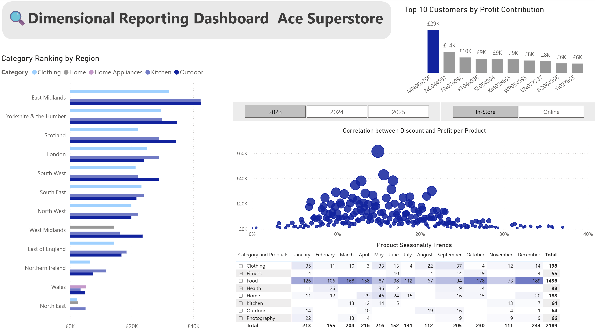
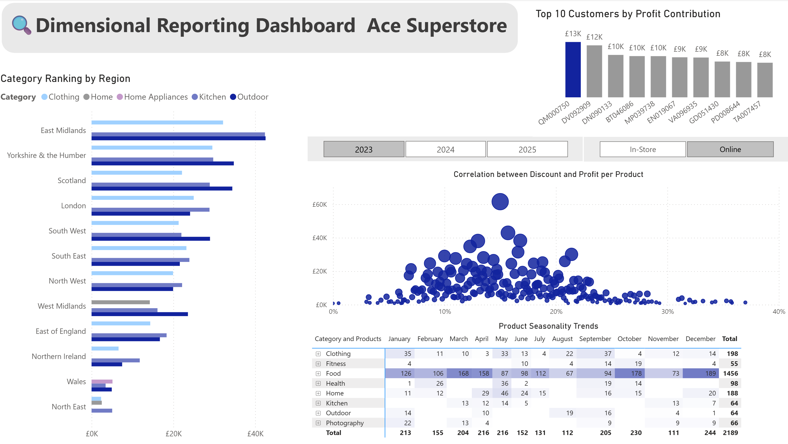
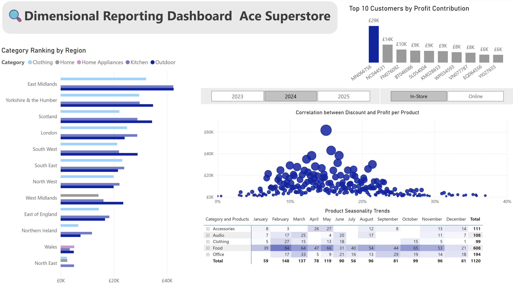
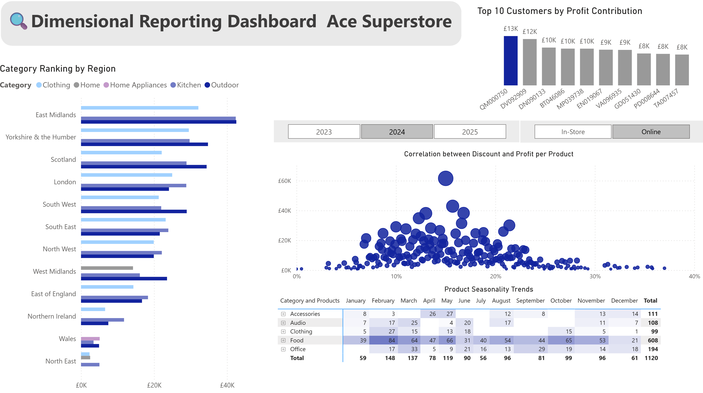
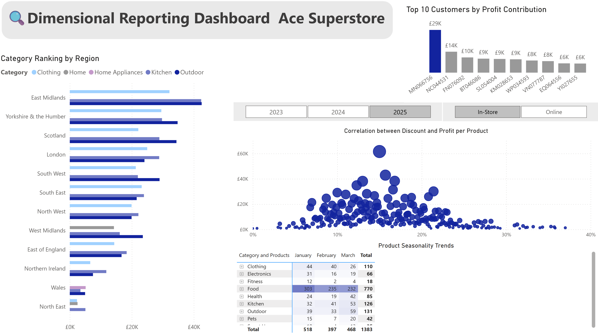
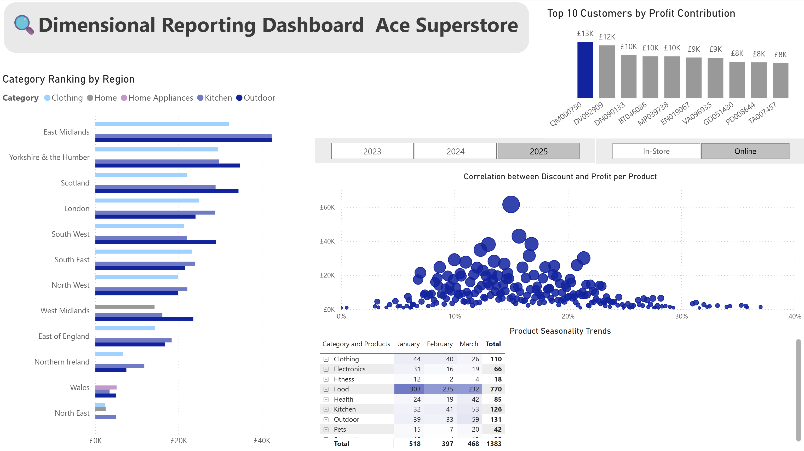

# 📊RDAMP-Dimensional-Model-PowerBI: Ace Superstore – Sales & Profitability Dashboard

## 📌 Project Overview

This project delivers an end-to-end data pipeline and dashboard solution for **Ace Superstore**, transforming raw retail data into an optimized star schema and an interactive **Power BI dashboard**. The goal is to empower business users with deep, multi-angle insights into sales, profit, customer behavior, and regional performance.

Built with dimensional modeling and SQL best practices, the reporting system supports scalable, query-efficient analysis across the organization.

---

## 📈 Business Insights

- **Top Profit Categories:** The most profitable categories across nearly all regions are **Outdoor**, **Kitchen**, and **Clothing**, in that order.
- **Highest Volume Category:** **Food** leads in total units sold consistently throughout the year, despite lower profit margins.
- **Best Performing Product:** The **Action Camera** stands out with the highest profit relative to its average discount rate — indicating strong pricing efficiency.
- **Top Customers:**
   The highest profit-generating customers were:
   * **MN066756** (In-Store)
   * **QM000750** (Online)
- 🧠 **Suggested Actions**

* **Prioritize high-margin categories** like Outdoor and Kitchen in marketing campaigns and shelf placement across all regions.
* **Review pricing strategy for the Food category**, which drives volume but not necessarily profit — consider bundling or upselling.
* **Replicate the pricing model of the Action Camera** across other electronics to maximize profit per discount.
* **Develop loyalty strategies** for top customers, such as exclusive offers or early access to promotions, segmented by channel.

---

> More Dashboard by filters

  
 2023 - Online

  

  
2024 - InStore 

  

  
2024 - Online

  

  
2025 - InStore

  

  
2025 - Online

  

---

## 🧱 Dimensional Schema Design

The solution is based on a **star schema**, designed to support analytical queries.

### 🗂️ Fact Table: `fact_sales`
- Contains transactional metrics at the order level.
- Measures:  
  - `total_sales`, `total_cost`, `profit`, `total_discount`, `quantity`
- Foreign keys to all dimensions.

### 🧭 Dimension Tables:
| Table | Description |
|-------|-------------|
| `dim_customer` | Unique customers (used for customer-level analysis) |
| `dim_product` | Product names and references |
| `dim_category` | Category for each product |
| `dim_segment` | Customer segments (e.g., Food-Snacks => Snack) |
| `dim_location` | City, region,postal code, and country |
| `dim_date` | Order date, month, quarter, and year |
| `dim_order_mode` | Sales channel (In-Store, Online) |

> 📌 See `Mariel_Palacio_Database_Schema.png` .

---

## ⚙️ SQL Setup Instructions

1. Open the provided Jupyter notebook or Colab file.
2. Load the dataset into a pandas DataFrame.
3. Run the schema creation scripts:
   - All `CREATE TABLE` statements are stored in `Mariel_Palacio_create_tables.sql`
4. Load the dimension tables using `.to_sql(...)` from pandas.
5. Create `fact_sales` with cleaned and mapped foreign keys.
6. Build SQL views for key analytical queries:
   - See `Mariel_Palacio_create_views.sql`

---

## 🔌 Power BI Connection Steps

1. Export your SQLite database (`.db` or `.sqlite`) from your Python environment.
2. Open **Power BI Desktop**.
3. Go to `Get Data > More > Database > SQLite`.
4. Connect to the exported database file.
5. Load all `dim_` tables, `fact_sales`, and views such as:
   - `vw_product_seasonality`
   - `vw_discount_impact_analysis`
   - `vw_customer_order_patterns`
   - `vw_channel_margin_report`
   - `vw_region_category_rankings`

> 🧠 Power BI relationships are automatically inferred from foreign keys. Validate and adjust if needed.

---

## 📊 Dashboard Views & Screenshots

### **Product Seasonality Trends (Heatmap)**
- Shows monthly demand pattern by product.
- Useful for inventory planning and seasonal promotions.

### **Discount vs Profit Analysis (Scatter Plot)**
- Reveals how discounts correlate with profit per product.
- Helps identify over-discounted or underperforming items.

### **Top 10 Customers by Profit Contribution (Horizontal Bar Chart)**
- Identifies the most valuable customers.
- Drives loyalty, personalization and premium offers.

### **Category Ranking by Region (Stacked Bar or Matrix)**
- Compares profit contribution of product categories by region.
- Informs inventory and expansion decisions.

> A planned chart could not be implemented at this stage. The issue has been noted for further investigation and may be included as part of a future upgrade to the dashboard.
> 
### Objective:❓🤔 **Average Order Value by Channel and Segment (Combo Chart)**
- Analyzes how customer segments spend across sales channels.
- Supports marketing personalization and channel optimization.

